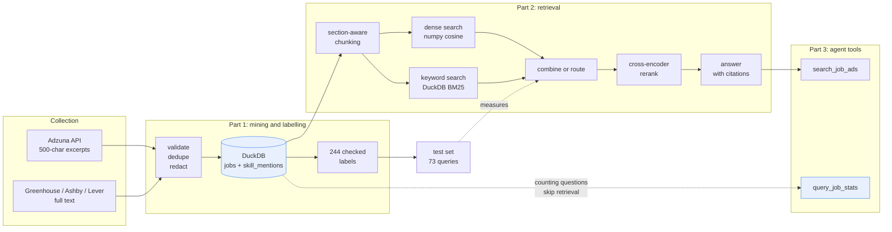

# AI-Aware Data Job Market Intelligence

**A search and question-answering system over 705 licensed Australian job
advertisements, where every design decision is backed by a measurement instead
of an assumption. Three of those measurements argued against the design that
was already built, and the system changed.**

`Python` · `DuckDB` · `dbt Core` · `FastAPI` · `sentence-transformers` · `MCP` · `Docker`

An optional [dbt + DuckDB analytics layer](dbt/README.md) adds staging models,
analytical marts, column documentation and tested parity with the original SQL
views. It runs locally and retains Python preprocessing upstream.

The repository has two parts that share one corpus.

**Part 1** collects, validates and labels the advertisements, then analyses
them. It asks whether entry-level data roles still present coding as a
standalone skill, or whether they increasingly tie it to automation, GenAI
tools and communication with stakeholders.

**Part 2** turns that corpus into a search and question-answering system, then
tests it: section-aware chunking, keyword and dense search, query routing,
reranking, a 73-query test set, and two agent tools exposed over MCP.

The two parts share more than a data source. The hand-checked labels from Part
1 become the relevance judgements in Part 2. The skill dictionary from Part 1
becomes the ground truth for keyword queries. And the privacy rule from Part 1,
that licensed text stays private and only summary numbers are published, is
what shaped the whole deployment design.



> **About the data.** Raw advertisements are never committed to this
> repository. `data/public/` holds summary tables from Part 1 with small cells
> removed. `reports/retrieval/` holds the evaluation tables from Part 2.
> `eval/golden/` holds the test queries and hashed document ids. The full
> corpus, the text chunks and the embeddings all stay in `data/private/`.
> `data/synthetic/retrieval_corpus.csv` is a set of made-up advertisements so
> that anyone can run the pipeline without the licensed data.

The original project proposal is kept in
[`README_AI_Data_Job_Market_Intelligence.md`](README_AI_Data_Job_Market_Intelligence.md).

## Key findings

From a 73-query test set. Systems are compared on the same queries and reported
with 95% confidence intervals, in
[`reports/retrieval/paired_comparisons.csv`](reports/retrieval/paired_comparisons.csv).

**1. On keyword queries, the whole complex pipeline only matches plain BM25.**
Combined search plus a cross-encoder reranker scores 0.976 on nDCG@10. Plain
BM25, a ranking formula from 1994, scores 0.979. The difference is +0.0036 in
BM25's favour with a 95% interval of [0.0000, +0.0105], so the two cannot be
told apart. Across the 22 keyword queries, BM25 wins 2 and loses none. For that
tie the pipeline costs an extra 340 ms per query, an embedding model, a
cross-encoder and an index to keep in step with the code.

**2. Picking one search method per query beats blending both.** Blending is
worse than the better single method on both query types. On keyword queries it
scores 0.891 against BM25's 0.979. On paraphrase queries it scores 0.323
against dense search's 0.340. Classifying the query first and running only the
matching method recovers both peaks. It beats blending by +0.027 with an
interval of [+0.001, +0.055], and it matches blending plus reranking while
running in about 19 ms instead of about 380 ms.

That advantage is real but thin, and this project can say exactly how thin.
Routing only pays off if the classifier is right at least **87.9%** of the
time. On held-out queries the classifier is 12 for 12, but 12 correct answers
out of 12 only supports a 95% lower bound of **0.758**, which is below the
break-even point. Routing is the better bet on this evidence. It is not a
settled result.

**3. Real questions mix both types, and routing is weakest there.** A query
like "Python roles in Melbourne that involve explaining results to
non-technical people" has a keyword part and a meaning part in one sentence.
On 12 such queries, routing is the worst option measured, at 0.172. The
classifier reads them as paraphrase queries and sends them to dense search,
which handles their keyword half badly. Blending is not the answer either.
Plain BM25 scores 0.318 on the same queries, against blending's 0.201.

**4. BM25 is the strongest single part of this system.** It is best or joint
best on keyword queries at 0.979 and on mixed queries at 0.318, and it holds up
on counting queries. Dense search earns its place on exactly one query type,
pure paraphrase, where it more than doubles BM25 at 0.340 against 0.148.
Everything expensive in the pipeline exists to serve the one case where the
cheap method fails.

**5. Search cannot answer counting questions.** Asking "how many
advertisements require SQL" needs every row, but search returns the ten best
matches. Across 17 counting queries, recall@10 cannot rise above 0.178 on
average, no matter how good the ranking is. These questions are sent to SQL
over the analysis database instead, through a separate agent tool.

**6. No vector database.** Scanning every vector one by one takes 0.33 ms, which
is 0.7% of the search pipeline and 55 times less than encoding the query being
searched. The whole dense index is 3.5 MB.

## Contents

- [Key findings](#key-findings)
- [Part 1: data mining and labelling](#part-1-data-mining-and-labelling)
  - [Optional dbt analytics layer](#optional-dbt-analytics-layer)
- [Part 2: search and question answering](#part-2-search-and-question-answering)
  - [Corpus and chunking](#corpus-and-chunking)
  - [The test set](#the-test-set)
  - [Comparison results](#comparison-results)
  - [What search cannot answer](#what-search-cannot-answer)
  - [Cost and speed](#cost-and-speed)
  - [Licensing and privacy](#licensing-and-privacy)
- [Part 3: service and MCP server](#part-3-service-and-mcp-server)
- [Deployment](#deployment)
- [Running this yourself](#running-this-yourself)
- [What this does not do](#what-this-does-not-do)

---

# Part 1: data mining and labelling

> **Scope note.** The numbers in this part describe the Part 1 study corpus:
> 421 clean Adzuna advertisements from Sydney and Melbourne. Part 2 uses a
> different and larger corpus of 705 advertisements, because search needs full
> text and needs every labelled advertisement kept. The two counts are meant to
> differ. See [Corpus and chunking](#corpus-and-chunking) for how the Part 2
> corpus is built.

## What Part 1 covers

- Sydney and Melbourne
- Search queries aimed at entry-level roles and at AI-related roles
- Role families: Data Analyst and BI, Data Engineer, Data Scientist and ML,
  AI and Automation, and mixed
- Entry-fit labels: likely entry-level, experienced role, or unclear
- AI signals: named GenAI and LLM tools, workflow automation, and vague AI
  language
- Coding signals: standalone coding, automation and scripting, or production
  engineering
- Skill extraction across technical, AI tooling, automation and professional
  skills
- Skill context: required, preferred, negated, alternative, or mentioned
- Removal of exact and near duplicate advertisements
- DuckDB analysis tables
- A TF-IDF and logistic regression baseline for role classification
- Cross-validation grouped by company, to reduce leakage
- TF-IDF and KMeans clustering to find job families
- Association rules over skills, with support, confidence and lift
- LLM-assisted label review with strict JSON validation
- A Streamlit dashboard and a privacy-preserving job description comparison

The free Adzuna API cuts each description at about 500 characters. Public skill
results therefore count mentions inside those excerpts. They do not measure the
full requirements of a job, and they do not show that AI has changed the labour
market.

## What the labelling found

The private Adzuna snapshot holds 508 raw rows. After cleaning and removing
duplicates, 421 advertisements remain, posted between 2026-03-25 and
2026-06-23. Because 94.77% of descriptions are exactly 500 characters long,
every claim is stated as evidence about excerpts rather than about whole
advertisements.

The labelled sample holds 244 advertisements. Every one was labelled by hand
and then reviewed with Claude. The review found 71 rows where the human label
and the model label disagreed. Reviewing those by hand changed 33 labels:

- AI signal: 21 changes
- Coding signal: 8 changes
- Entry fit: 6 changes
- Role: 3 changes

Final label counts:

| Dimension | Counts |
|---|---|
| Role | Other or Mixed 132, Data Analyst or BI 35, AI or Automation 31, Data Engineer 23, Data Scientist or ML 23 |
| Entry fit | Experienced 124, unclear 73, likely entry-level 47 |
| AI signal | No AI signal 163, explicit AI or ML system work 34, AI-adjacent but vague 26, explicit GenAI or LLM 12, workflow automation 6, unclear 3 |
| Coding signal | No coding signal 162, production engineering 64, automation or scripting 15, standalone coding skill 3 |

What this shows, for these excerpts only. Explicit AI and GenAI language
concentrates in AI or Automation roles and in Data Scientist or ML roles.
Entry-level and analyst roles more often show no AI signal at all. Coding
language is strongest in Data Engineer roles. "No coding signal" means the
excerpt contains no evidence of coding. It does not mean the real job needs no
coding.

Main output files:

- [`reports/adjudicated_annotation_summary.json`](reports/adjudicated_annotation_summary.json)
- [`reports/semantic_label_distribution.csv`](reports/semantic_label_distribution.csv)
- [`reports/semantic_role_ai_signal.csv`](reports/semantic_role_ai_signal.csv)
- [`reports/semantic_role_coding_signal.csv`](reports/semantic_role_coding_signal.csv)
- [`reports/human_llm_audit_annotation_quality.json`](reports/human_llm_audit_annotation_quality.json)
- [`reports/mining_summary.json`](reports/mining_summary.json)

An open benchmark is also included. `scripts/fetch_skillspan.py` and
`scripts/evaluate_skillspan.py` measure the skill dictionary against the
MIT-licensed SkillSpan test set. Results are in
[`reports/model_evaluation.md`](reports/model_evaluation.md): precision 0.831,
recall 0.147, F1 0.250. The low recall is reported as a known weakness and a
clear next task, rather than hidden behind numbers from synthetic data.

## Quick start

```bash
python3 -m venv .venv
source .venv/bin/activate
pip install -e ".[dev]"
python scripts/run_pipeline.py
streamlit run app/streamlit_app.py
```

Checks:

```bash
pytest
ruff check .
```

The pipeline writes `data/synthetic/job_ads.csv`, builds cleaned tables in
`data/processed/job_market.duckdb`, saves the baseline model to
`data/processed/role_classifier.joblib`, and writes metrics to
`reports/model_metrics.json`.

## Optional dbt analytics layer

The [dbt project](dbt/README.md) rebuilds two existing analytical summaries from
processed pipeline outputs in a separate local DuckDB database. Two staging
models normalise fields and remove repeated skill mentions. Two marts calculate
role/city counts and skill shares. The skill-share denominator includes ads with
no extracted skill mentions.

The layer includes column-level documentation and 31 data tests covering nulls,
unique identifiers, accepted values, referential integrity, valid shares and
bidirectional reconciliation with the original SQL views. A synthetic integration
test injects duplicate IDs, blank cities, invalid contexts and orphan references
to verify failure detection and downstream model skips. A dedicated CI job runs
this check without licensed data.

[Local verification results](reports/dbt_validation.json) cover 54 synthetic ads,
a 134-row local processed dataset and the 705-ad retrieval corpus. The 134-row
input is a separate local dataset, not a replacement for the 421-ad study corpus.
Python still owns redaction, fuzzy deduplication, role labels and skill extraction.
The existing application does not yet consume these dbt marts, and real-data
marts remain private and unsuppressed. This is a local analytics-layer addition,
not a full pipeline replacement or cloud deployment.

See the [setup, model definitions and verification commands](dbt/README.md) to
reproduce the run and generate the dbt documentation and dependency graph.

## Using your own data

Supply a CSV with the fields listed in
[`docs/DATA_CARD.md`](docs/DATA_CARD.md):

```bash
python scripts/run_pipeline.py --input /path/to/permitted_job_ads.csv
```

Your input may leave `role_label` empty. If it does, the demo classifier trains
on the synthetic fixture instead. To train on a separate labelled set, pass it
directly:

```bash
python scripts/run_pipeline.py \
  --input /path/to/permitted_job_ads.csv \
  --training-input /path/to/labelled_training_ads.csv
```

Git ignores raw data. Do not commit job descriptions unless their licence
clearly allows it. The pipeline does not scrape job boards and does not get
around access controls.

## Collecting real data

The repository includes an Adzuna Australia collector that uses your own API
key and keeps every row private. It makes no network request until you
configure credentials.

```bash
cp .env.example .env
# Add ADZUNA_APP_ID and ADZUNA_APP_KEY locally.
python scripts/fetch_adzuna.py
python scripts/run_pipeline.py --input data/private/adzuna/job_ads.csv
python scripts/mine_job_market.py
python scripts/build_semantic_analysis.py
python scripts/build_public_release.py \
  --document-labels data/private/annotations_expanded/processed_adjudicated/document_labels.csv
streamlit run app/public_dashboard.py
```

By default the collector uses the `entry_level` and `ai_signal` query groups.
Add a general baseline with:

```bash
python scripts/fetch_adzuna.py \
  --query-group entry_level \
  --query-group ai_signal \
  --query-group general_baseline
```

The public exporter requires at least ten advertisements per published cell,
and it cannot output job ids, titles, descriptions, companies, URLs or source
text. `app/streamlit_app.py` is a local tool for the analyst and must never be
deployed against a real row-level database. See
[`docs/ADZUNA_USAGE.md`](docs/ADZUNA_USAGE.md) for terms, attribution,
retention and deletion.

## Labelling workflow

After the private analysis, build annotation tasks that keep companies apart
across splits and never expose job text publicly. These tasks are for checking
a sample by hand and for auditing prompts, not for labelling the whole dataset
by hand:

```bash
python scripts/prepare_annotations.py
```

The task files and the frozen split manifest are documented in
[`docs/ANNOTATION_GUIDE.md`](docs/ANNOTATION_GUIDE.md). After annotation,
`scripts/process_annotations.py` validates the Doccano exports strictly, keeps
the normalised labels private, and writes an agreement report that contains no
job text. Test-split exports stay locked unless you pass `--include-test`.

For LLM-assisted review, first preview the prompts without sending anything to
an API:

```bash
python scripts/llm_audit_document_labels.py --limit 5
```

To call an OpenAI-compatible endpoint, set `LLM_API_KEY` and `LLM_MODEL` in
`.env`, then state clearly that private excerpts may be sent to that provider:

```bash
python scripts/llm_audit_document_labels.py \
  --run-api \
  --acknowledge-private-text \
  --limit 50
```

The output follows the same shape as a human annotation export, so it can be
validated as a second annotator:

```bash
python scripts/process_annotations.py \
  --manifest data/private/annotations_expanded/manifest.csv \
  --document-export data/private/annotations_expanded/exports/documents-annotator-1.business_context_v3_candidate.jsonl \
  --document-export data/private/annotations_expanded/exports/documents-llm-audit.jsonl \
  --output data/private/annotations_expanded/processed_human_llm_audit \
  --report reports/human_llm_audit_annotation_quality.json
```

LLM output is a review aid. Final claims rest on aggregate results and on human
checks of a sample, not on unchecked model labels.

Build a review sheet covering only the rows where human and model disagreed:

```bash
python scripts/summarize_llm_audit.py
python scripts/prepare_label_adjudication.py
```

Fill the `final_*` columns in
`data/private/annotations_expanded/label_adjudication_with_source.csv` for the
disputed rows, then apply them:

```bash
python scripts/apply_label_adjudication.py
python scripts/build_semantic_analysis.py \
  --document-labels data/private/annotations_expanded/processed_adjudicated/document_labels.csv
```

---

# Part 2: search and question answering

A search system over the same advertisements, built so that every design
decision is backed by a measurement. Getting a search pipeline to run is a
tutorial exercise. The work here is in the test set, the comparisons, and the
three results that argued against the design.

## Corpus and chunking

| Source | Advertisements | Chunks at 512 tokens | Typical chunk |
|---|---|---|---|
| Full text (Greenhouse, Ashby, Lever) | 236 | 1,947 | 179 tokens |
| Excerpts (Adzuna free tier) | 469 | 469 | 125 tokens |
| **Total** | **705** | **2,416** | |

This corpus is larger than the 421 used in Part 1 for two reasons. Search needs
full text, so 31 public company job boards were added. And the domain filter
and date window used in Part 1 are switched off here, because the domain filter
alone would drop 106 of the 244 labelled advertisements and gut the test set.

**Chunking splits on sections, not on character counts.** A job advertisement
is a list of labelled sections, and the requirements section answers most
queries. `retrieval/chunking.py` finds the headings, splits on real section
boundaries first, then packs whole sentences and bullet points into token
windows. A bullet point is never cut in half. 72% of full-text chunks carry a
known section label such as `requirements`, `responsibilities`, `benefits` or
`legal`, which also gives the agent tools a section filter.

This needed a fix to the collector first. `html_to_text()` flattened every
advertisement into a single line, which destroyed the heading and list markup
that section splitting depends on. Job board advertisements arrived with **zero
newlines each**. The collectors now keep a second copy of the description with
the layout intact, averaging 85 lines and 12.6 bullet points per advertisement.
The flat copy still feeds deduplication and skill extraction unchanged.

**Two thirds of the corpus cannot be chunked at all.** The free Adzuna tier
cuts descriptions at about 500 characters, which is one chunk at any window
size. Every chunk carries an `is_truncated` flag, and the chunk size comparison
is reported on the full-text advertisements only, because on the excerpts it is
not just flat, it is undefined.

## The test set

73 queries, split into four types and always reported by type. The full method
and its known biases are in [`eval/golden/README.md`](eval/golden/README.md).

| Type | Queries | Where relevance comes from | Median relevant ads |
|---|---|---|---|
| **keyword** | 22 | The term appears in the advertisement | 10.5 |
| **paraphrase** | 22 | Skill extractor and the 244 checked labels | 24 |
| **mixed** | 12 | Both of the above, intersected | 7 |
| **counting** | 17 | Skill, label and metadata rules | 52 |

Relevance is judged per advertisement, not per chunk, so three chunks from one
advertisement count once.

The **mixed** type was added after the first round of results, because the
original three-way split flattered routing. A test set where every query is
cleanly one type cannot expose a router that has to pick one type. A mixed
query such as "Python roles in Melbourne that involve explaining results to
non-technical people" is resolved by intersecting its parts, so an
advertisement counts only if it satisfies all of them.

Relevance judgements are not written by hand. Each query carries a **rule** that
resolves against the corpus, so the repository commits the rule rather than the
answer. Three of the four rule types reuse work Part 1 had already done and
checked.

**nDCG@10 is the main metric.** recall@10 cannot rise above
`min(10, number of relevant) / number of relevant`, and relevant set sizes
differ by more than ten times between query types. The counting queries have an
average recall@10 ceiling of 0.178. nDCG corrects for this, and the ceiling is
published next to every recall figure.

## Comparison results

nDCG@10 by query type, using 512-token chunks unless stated. Full tables with
confidence intervals are in [`reports/retrieval/`](reports/retrieval/).

| Setup | keyword | paraphrase | mixed | counting | speed |
|---|---|---|---|---|---|
| BM25 only | **0.979** | 0.148 | **0.318** | 0.506 | 29 ms |
| Dense only (bge-small) | 0.539 | **0.340** | 0.172 | 0.553 | 14 ms |
| Blended (RRF) | 0.891 | 0.323 | 0.201 | 0.631 | 33 ms |
| Blended plus rerank | 0.976 | 0.329 | 0.300 | **0.669** | 381 ms |
| **Routed** | **0.979** | **0.340** | 0.172 | 0.631 | **19 ms** |
| Blended, 256-token chunks | 0.900 | 0.322 | 0.201 | 0.636 | 32 ms |
| Blended, 1024-token chunks | 0.891 | 0.329 | 0.201 | 0.630 | 32 ms |
| Blended, all-mpnet-base-v2 | 0.787 | 0.340 | 0.236 | 0.606 | 62 ms |

**The two search methods fail in opposite ways.** Dense search collapses on
tool names, scoring 0.539 against BM25's 0.979, because an embedding model
generalises `dbt` towards "data modelling" and returns advertisements that
never contain the word. BM25 collapses on paraphrases, scoring 0.148 against
dense search's 0.340, because the query and the advertisement share almost no
words.

**Blending lands below the better method on both types.** That is what
reciprocal rank fusion does when one branch is confidently wrong. It scores by
rank position, so a document that dense search puts first gets pulled up even
though it never contains the searched term.

**Routing recovers both peaks.** `mode="routed"` classifies the query and runs
one method only. Keyword queries go to BM25, paraphrase queries go to dense
search, counting queries fall back to blending but in practice never reach
search at all.

| Comparison, same queries, nDCG@10 | Difference | 95% interval | Reading |
|---|---|---|---|
| BM25 minus blended, keyword | +0.088 | [+0.043, +0.142] | BM25 better, wins 11, **loses 0** |
| BM25 minus blended plus rerank, keyword | +0.004 | [0.000, +0.011] | cannot be told apart, wins 2, loses 0 |
| Routed minus blended, keyword | +0.088 | [+0.043, +0.142] | routed better |
| Routed minus blended, overall | +0.027 | [+0.001, +0.055] | routed better, barely |
| **Routed minus blended, mixed** | **-0.029** | **[-0.071, +0.000]** | **routed worse** |
| Routed minus blended plus rerank, mixed | -0.128 | [-0.217, -0.042] | **routed clearly worse** |
| Routed minus blended plus rerank, overall | -0.026 | [-0.057, +0.005] | cannot be told apart, at 1/20 the cost |
| Dense minus blended, keyword | -0.352 | [-0.458, -0.250] | dense much worse, **loses 19 of 22** |

Each comparison runs both setups on the same queries and tests the difference
directly. This matters because the variation between queries is large. A query
with 3 relevant advertisements and one with 81 score nothing alike, so two
overlapping per-system intervals do not mean two systems are equal. The BM25
versus blended keyword result is a case where the paired test separates them
and the summary table does not.

**Routing depends on the classifier, and the condition is not comfortably met.**
Solving for the accuracy where routing and blending break even gives **87.9%**.
Against that:

| Evidence for the query-type decision | Correct | 95% lower bound | Clears 87.9%? |
|---|---|---|---|
| Held-out probes | 12/12 | **0.758** | **no** |
| Pooled with the probes used for tuning | 27/27 | 0.875 | no, just short |

Twelve correct answers out of twelve is not strong evidence, and quoting only
the point estimate would overstate it. Routing is the better bet here, not a
settled result. Growing the probe set is the cheapest way to settle it. Forty
correct out of forty would put the lower bound at 0.912 and clear the bar
properly. These numbers come from `scripts/evaluate_routing.py`.

**Chunk size makes no difference.** 256, 512 and 1024 tokens score 0.900, 0.891
and 0.891, with intervals that almost fully overlap. Section-aware chunking is
the reason. Sections are shorter than the window, so the section boundary
decides the split and the token budget never binds. The median chunk stays near
179 tokens whichever budget is set. The result is still useful, because it says
this setting does not need tuning and the effort belongs elsewhere.

**The smaller embedding model is better.** bge-small beats all-mpnet-base-v2 on
keyword queries, 0.891 against 0.787, and ties on paraphrase queries, while
producing 384-dimensional vectors instead of 768. Half the index and roughly
half the encoding time.

**Reranking repairs blending rather than improving search.** It lifts blending
from 0.891 to 0.976 on keyword queries, but 0.976 is where plain BM25 already
sat, and it moves paraphrase queries not at all, 0.323 to 0.329. The
cross-encoder is undoing the damage the dense branch did to the blended
ranking. Route instead of blend and there is nothing left to repair.

**The keyword result is not an artefact of the skill dictionary.** Twelve of
the 22 keyword queries use tools deliberately left out of the dictionary that
produced the skill data. Dense search scores 0.508 on dictionary terms and
0.565 on non-dictionary terms. BM25 scores 1.000 and 0.962. The two groups
behave the same, so the finding is about search, not about a circular test set.

**How much of this is real?** The confidence interval on the baseline's
recall@10 has a half-width of 0.076. Differences smaller than about 8 points
sit inside the noise of a 73-query set. The gap between dense search and BM25
on keyword queries is 0.44 nDCG, which is nearly six times that. The chunk size
differences are 0.009, which is about a tenth of it.

## What search cannot answer

Ask a search system "how many advertisements require SQL" and it returns its
five best passages. An answer built from those five will state a number, that
number will be wrong, and it will sound exactly as confident as a correct one.
Nothing in the pipeline separates "the five best matches" from "all 705".

This is measurable, not just an argument. Across the 17 counting queries,
recall@10 has an average ceiling of **0.178**. A perfect ranker returning ten
advertisements still sees less than a fifth of what the question is about. For
"what is the total number of advertisements" the ceiling is 0.014. No amount of
search quality fixes this, because the question needs the whole population and
search exists to discard most of it.

So counting questions do not go to search. `rag/routing.py` classifies the
question and sends population questions to `query_job_stats`, which runs SQL
over the DuckDB tables Part 1 already built. The same classifier makes a second
decision. Once it has decided a question is not a counting question, it decides
whether the question is keyword or paraphrase and picks the search method. One
classifier, two decisions, with different costs when it is wrong. A missed
counting question gives a hedged answer. A missed keyword or paraphrase call
gives a slightly worse ranking.

Three defences against wrong counting answers, in order:

1. **The classifier**, which runs before the question is answered. On 18
   held-out probes written after the rules were frozen it is right 15 times.
   But on counting detection alone it is right only **3 times out of 6**. That
   is the decision this defence actually rests on, and a coin flip is why it is
   not the only defence. Every one of the three misses sent a counting question
   to search, which is the dangerous direction.
2. **The tool descriptions** in `mcp_server/server.py`, which tell the model
   when not to use search, in the text the model actually reads.
   `search_job_ads` also returns a warning when it detects that it has been
   handed a counting question anyway.
3. **The answer prompt**, which forbids stating any count, total or share from
   retrieved passages and requires the model to say the statistics tool is
   needed instead.

`query_job_stats` takes a **named dimension, never SQL**. A tool that accepts a
SQL string from a model is an open read primitive against a database of
licensed private text, and no prompt instruction constrains that reliably.

## Cost and speed

Time per stage across the test queries, over 2,416 chunks. Full numbers in
[`reports/retrieval/cost_latency.json`](reports/retrieval/cost_latency.json).

| Stage | median | 95th percentile | Share |
|---|---|---|---|
| Encoding the query | 18.1 ms | 21.9 ms | 40% |
| Dense scan, one vector at a time | **0.33 ms** | 0.40 ms | 0.7% |
| BM25 in DuckDB | 28.3 ms | 32.2 ms | 59% |
| Combining the two rankings | 0.16 ms | 0.22 ms | 0.4% |
| Cross-encoder rerank | 335 ms | 408 ms | **88% when on** |

Absolute times move by about a third between runs depending on what else the
machine is doing. The shares stay stable. This is why the container limits the
service to 2 CPUs. See [Deployment](#deployment).

**Why there is no vector database.** Scanning all 2,416 vectors takes 0.33 ms.
That is 0.7% of a 45 ms search pipeline, and 55 times less than encoding the
query being searched. The whole dense index is 3.5 MB. An approximate index
would speed up the cheapest stage, give up exact results to do it, and add a
build step and a dependency to run. `retrieval/dense.py` is the one place that
would change if the corpus grew past roughly 100,000 chunks.

**Do not ship the reranker here.** It costs an extra 340 ms per query and no
token spend, because the cross-encoder runs locally. It buys 8.5 points on
keyword queries over blending. But routing reaches the same quality for a few
milliseconds, so the reranker is paying 340 ms to fix a problem routing removes.
End to end, routing runs in about **19 ms against about 380 ms** and cannot be
told apart on quality, with a difference of -0.005 and an interval of [-0.035,
+0.025]. Over a thousand queries that is about 19 seconds against about 6.5
minutes.

The reranker stays in the codebase, because the measurement that rules it out
is part of the work, and because it would become the right choice on a corpus
where one method alone is not enough.

**Answer cost.** About 1,190 input tokens per answer at five passages, or about
**$7.31 per thousand answers** at $3 and $15 per million tokens in and out. The
embedding cache turns a repeated query into a dictionary lookup, a 424 times
speed-up that matters most when re-running the comparison grid.

## Licensing and privacy

A search system exists to show source text. This project's data terms say the
source text stays private. That conflict is real, and resolving it shaped the
design.

- **Chunks, embeddings and the keyword index never enter Git.** They come from
  licensed text and live in `data/private/retrieval/`, which `.gitignore`
  excludes completely.
- **The test set commits its rules, not its answers.** `queries.jsonl` holds
  the queries and the rules that resolve them. `relevance_hashed.jsonl` holds
  counts and 20-character hashes of the advertisement ids, matching the
  convention already used by the annotation manifest in Part 1. Real ids stay
  in `data/private/`.
- **This is enforced, not just documented.** `tests/test_retrieval_privacy.py`
  fails if any advertisement id or any fragment of advertisement text appears
  in a committed file, and if the private files stop being ignored by Git.
- **The API and MCP server bind to localhost and are never deployed.**
  Publishing the service would publish the corpus.
- **A synthetic corpus stands in for reproducibility.**
  `data/synthetic/retrieval_corpus.csv` holds 28 invented full-text
  advertisements with real section structure, naming the same tools the keyword
  queries use, so the whole pipeline runs without the licensed data.

---

# Part 3: service and MCP server

## FastAPI service

```bash
make install-retrieval
make api          # http://127.0.0.1:8000/docs
```

| Endpoint | What it does |
|---|---|
| `POST /search` | Ranked passages with scores, sections and source details |
| `POST /answer` | Routes the question, then answers with the right tool |
| `POST /stats` | Counts over a named dimension |
| `POST /reindex` | Rebuilds in the background and returns a job id at once |
| `GET /jobs/{id}` | Job status: queued, running, succeeded or failed |

Rebuilding the index takes minutes, so it runs on a background worker instead
of blocking the request. The new index is swapped in under a lock once it is
built, so searches keep using the old one until the new one is ready. A failure
leaves the running index untouched and is reported through the job record
rather than swallowed. The rebuild also switches the served configuration, so
asking for 256-token chunks serves 256-token chunks afterwards.

Set `RETRIEVAL_MODE` to `routed`, `hybrid`, `lexical` or `dense`. The default
is `routed`, which is what the measurements favour. Use `hybrid` if your
traffic is mostly mixed queries, where routing is measurably weakest.

## MCP server

```bash
make mcp          # stdio transport
```

Add this to your MCP client config:

```json
{
  "mcpServers": {
    "job-market": {
      "command": "/absolute/path/to/.venv/bin/python",
      "args": ["/absolute/path/to/mcp_server/server.py"]
    }
  }
}
```

Two tools, and the split between them is the point.

- **`search_job_ads(query, top_k, city?, role?, section?)`** returns passages
  showing how advertisements are worded.
- **`query_job_stats(dimension, filter_field?, filter_value?, limit?)`** returns
  exact counts over every advertisement, using SQL.

The tool descriptions are written for the model that reads them, not for a
human skimming this file. `search_job_ads` states plainly what it cannot do,
including that it has no view of the other advertisements and that any number
taken from its output will be wrong, and it names the tool to use instead.
`query_job_stats` lists the phrasings that should route to it. Both return
their caveats in the response, so a model that repeats a number also has the
caveat in front of it. Those caveats are that skill counts measure mentions
rather than confirmed requirements, that label dimensions cover only the 244
labelled advertisements, and that `role` is a model prediction for the rest.

---

# Deployment

```bash
make docker-build     # one image
make docker-verify    # privacy, non-root and offline checks
make docker-run       # build the index, then serve on 127.0.0.1:8000
```

**Image size, and which number is the real one.** Docker reports several
figures that differ by up to four times.

| Command | Size | What it measures |
|---|---|---|
| `docker history` layer sum | **1.54 GB** | Uncompressed, what the image takes on disk |
| `docker save \| wc -c` | **0.52 GB** | Compressed, what a pull transfers |
| `docker images` SIZE column | 2.05 GB | Both of the above added together |
| `docker image inspect --format '{{.Size}}'` | 0.70 GB | Compressed content, not the disk size |

The `docker images` column is a storage figure, not an image size. Under the
containerd image store it counts the compressed blobs and the unpacked copy.
Checked against a reference image: `alpine:3.20` reports 13.6 MB, which is
exactly its 9.5 MB of layers plus its 4.1 MB of blobs.

So the honest numbers are **1.54 GB on disk and 0.52 GB to transfer**. The
target set for this work was 1.5 GB, so it is **missed by 2.4%**. Getting truly
under that means replacing torch, which is 439 MB after stripping, with ONNX
Runtime. That would save roughly 400 MB and sentence-transformers supports it.
It is left undone on purpose. Changing the inference backend changes the
numbers the encoder produces, and every score in this README would need
re-measuring before it could be repeated. Shipping a smaller image by
invalidating the evaluation is the wrong trade for this project.

Starting point was 2.24 GB on disk. Two changes brought it to 1.54 GB.
Installing only the `service` dependency set, since the Streamlit dashboard
stack is about 130 MB that the API never renders. And stripping torch's bundled
test suite and C++ headers, about 155 MB used only when compiling against
torch. `torch/bin` is kept on purpose, because it holds `torch_shm_manager` and
torch fails at import without it. The build found that the hard way.

**One image, two entrypoints.** The API and the MCP server share the same
package, both models and DuckDB. Separate images would store the model weights
twice for no gain, so the entrypoint is chosen by the command.

**CPU-only torch, installed first.** A plain `pip install torch` pulls the CUDA
build and about a gigabyte of driver libraries that nothing here can use.
Installing from the CPU index before everything else stops another dependency
resolving the CUDA wheel behind it. The image carries `torch 2.14.0+cpu` and no
NVIDIA libraries, which a build step checks. Without this the image would be
over 3 GB.

One warning worth recording. A size check written against `docker image inspect
--format '{{.Size}}'` measures the compressed transfer size while appearing to
measure disk size, and will pass on an image three times its budget. The CI
check in this repository sums `docker history` instead.

**Model weights are baked in and pinned to exact commits.** Not for
convenience, but for repeatability. Models on the Hub can change under the same
name, and a comparison whose embedding model changes underneath it has no
control condition. The scores in this README hold only because
`MODEL_REVISIONS` in `retrieval/embedding.py` pins bge-small to `5c38ec7c` and
the cross-encoder to `233902d2`, and the Dockerfile bakes those same commits. A
test checks that the two agree. `HF_HUB_OFFLINE=1` in the running image turns
"works offline" from a claim into a check, because a weight that was not baked
in makes the container fail at startup instead of quietly downloading a
different version.

**`.dockerignore` is generated, not written by hand.** Keeping a second list of
paths that must never leave the repository guarantees it drifts from the first
one eventually. The privacy tests and `.dockerignore` both read
`src/job_market_intelligence/privacy.py`. `make dockerignore` regenerates the
file, and `tests/test_docker.py` fails if it is out of date.

**Data never enters the image.** The image holds code, models and the synthetic
corpus. Chunks, embeddings, the keyword index and the advertisement text are
mounted at run time, which is what lets the image be shared when the corpus
cannot be. `make docker-verify` checks this against the built image rather than
trusting the Dockerfile:

```
no private data in image; synthetic corpus present
runs as non-root
both models load with no network
duckdb fts extension loads with no network
```

**The offline check found a real bug, which is why it exists.** DuckDB
downloads its full-text search extension the first time a keyword index is
built. Every local run worked, because the extension was already cached in the
home directory. Inside a container with no network, building the index failed
outright. The extension is now baked in next to the model weights.
`make docker-offline-check` builds chunks and both indexes from the synthetic
corpus with no network at all, and CI runs it on every push.

**Speed figures are measured under a stated limit.** `docker-compose.yml` caps
the API at 2 CPUs and 4 GB. The 340 ms reranking cost is a property of that
setup, not a constant, and quoting it without the setup would make it
impossible to reproduce.

**Apple Silicon and multiple architectures.** Building on a Mac produces an
arm64 image by default, which fails with `exec format error` on an x86 host.
`make docker-build-multi` builds for both. CPU-only torch has wheels for each.

**Port 8000 is shared with the annotation server.** The Doccano container from
Part 1 binds port 8000 by default, and so does this API. Run one at a time, or
change one of them. `docker-compose.yml` publishes to `127.0.0.1:8000`
specifically, so a clash fails loudly at startup.

**Docker volumes are part of the privacy surface.** Annotating in Doccano
copies advertisement text into the `doccano-db` volume, where it outlives the
repository and is invisible to anything that scans the working tree.
`scripts/purge_private_data.py` reports such volumes in its dry run and removes
them with `--include-docker-volumes`. `docs/ADZUNA_USAGE.md` promises a
complete purge when API access ends, and a file sweep alone would not have
delivered one.

**Secrets are never baked in.** No API key appears in the Dockerfile or as a
default environment value. They are injected at run time through `env_file`,
and a test checks the Dockerfile for the three key names this project uses.

## Running the MCP server from the container

```json
{
  "mcpServers": {
    "job-market": {
      "command": "docker",
      "args": [
        "run", "-i", "--rm",
        "-v", "/absolute/path/to/data/private:/app/data/private:ro",
        "-e", "RETRIEVAL_ROOT=/app/data/private/retrieval",
        "job-market-intelligence:local",
        "python", "-m", "mcp_server.server"
      ]
    }
  }
}
```

It uses stdio, so no port is published and the corpus is mounted read-only.

---

# Running this yourself

## Without the licensed corpus

Everything except the real numbers runs on the synthetic corpus:

```bash
make install-retrieval
make synthetic-corpus
python scripts/run_pipeline.py \
  --input data/synthetic/retrieval_corpus.csv \
  --output-dir data/private/retrieval \
  --reports-dir data/private/retrieval/reports \
  --max-age-days 3650
make retrieval        # chunks, indexes, test set, comparisons, cost
```

The synthetic advertisements are invented and deliberately tidy. Section
detection scores 100% on them against 72% on the real corpus, so they check
that the pipeline runs, not how well it performs. Only the real corpus produces
the numbers in this file.

## With the licensed corpus

```bash
cp .env.example .env      # add ADZUNA_APP_ID and ADZUNA_APP_KEY
make retrieval-corpus     # fetch job boards, merge with Adzuna, run the pipeline
make retrieval            # chunk, index, resolve the test set, compare, measure
make check                # ruff and pytest
```

`make retrieval-corpus` writes to `data/private/retrieval/` and leaves the Part
1 database in `data/processed/` untouched, so the search corpus and the job
search corpus stay separate.

---

# What this does not do

Every number above has a weak point. These are the ones that would change a
decision.

**Routing is the least settled result.** It wins overall, but only if the query
classifier is right at least 87.9% of the time. The classifier is 12 out of 12
on held-out queries, which supports a 95% lower bound of 0.758, below that
break-even. And on mixed queries, the kind real users actually type, routing is
the worst option measured. The first version of the test set had no mixed
queries at all, which flattered routing. Adding them cut its advantage from
+0.038 to +0.027. **Next step:** a larger, independently written mixed query
set. Forty correct classifications out of forty would settle it.

**Counting detection is the weakest component.** The classifier catches only 3
of 6 held-out counting questions, and every miss sends one to search. Six
probes is too few to pin the rate down, but a coin flip is not a defence on its
own. This is why the answer prompt and the tool descriptions also block counted
answers, and why they matter more than the classifier does.

**Two thirds of the corpus is 500-character excerpts.** A skill missing from an
excerpt is not evidence the job does not need it. This also skews the test set:
85.7% of advertisements judged relevant to a keyword query are full text,
against 33.5% of the corpus. The main findings survive that split, checked both
ways, but absolute scores would be lower on a corpus of excerpts alone.

**73 queries resolve differences of about 8 points, no finer.** Rows in the
results table closer than that are not distinguishable. The paired comparisons
are more sensitive and are what the findings rest on.

**Answer quality is not measured end to end.** Citations are checked
mechanically, so an invented advertisement id is caught, but nobody has
reviewed at scale whether an answer is truly supported by the passage it cites.
The comparisons measure search. Whether better search produces better answers
is assumed here, not shown.

**The corpus is a convenience sample.** Advertisements come from Adzuna's
Australian index and 31 public company job boards chosen because they list
Australian roles. It leans towards large technology employers and is not a
random sample of the market.

**What this project claims.** It measures the language used in the
advertisements it collected. It does not measure the whole labour market, does
not observe hiring decisions, and does not claim that AI has replaced coding
skills. The job description comparison describes how a pasted advertisement
differs from similar ones in the sample. It does not assess a candidate.

---

# Licence

Code in this repository is under the MIT Licence. Dataset licences are
separate. The synthetic datasets are generated by this project and may be used
under the same MIT terms. Third-party datasets keep their own licence and
attribution.
